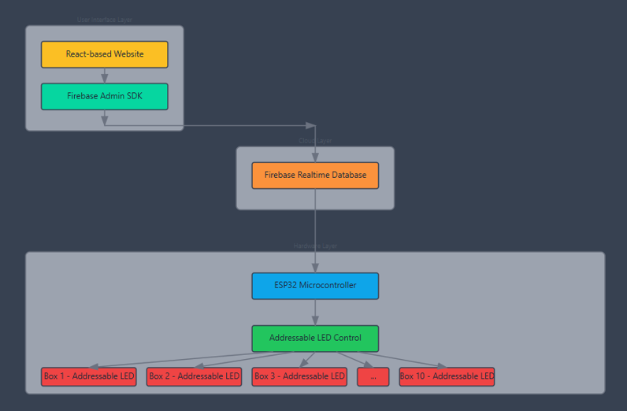
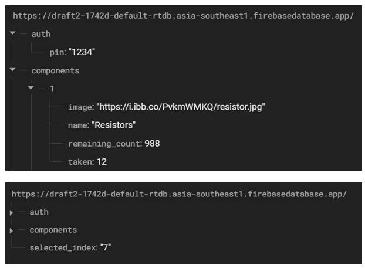
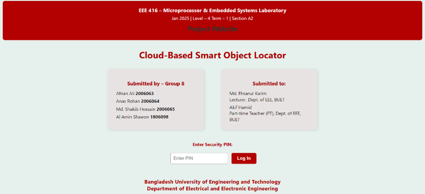
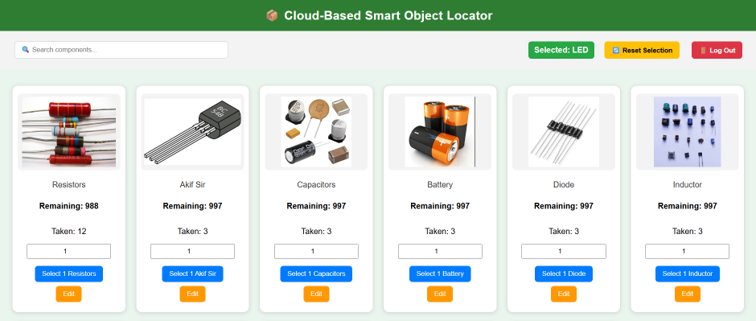
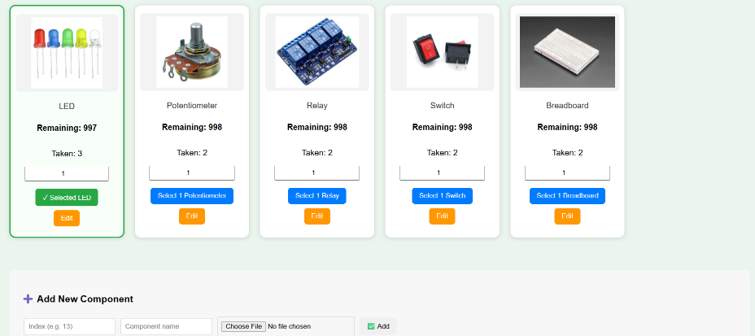
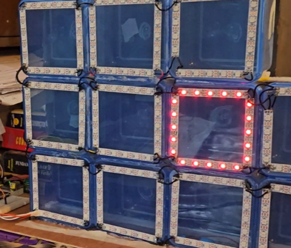
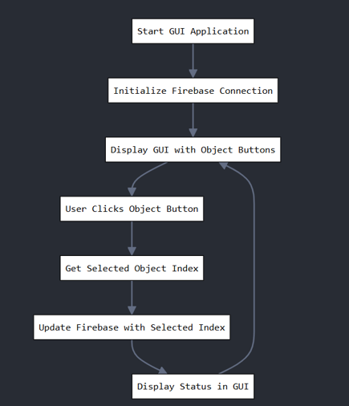

# Cloud-Based Smart Object Locator

**Course:** EEE 416 - Microprocessor & Embedded Systems Laboratory  
**Domains:** Internet of Things (IoT), Embedded Systems, Full-Stack Web Development, Cloud Integration  

## Project Overview
This project introduces a Cloud-Based Smart Object Locator system that allows users to remotely identify and locate components stored in organized boxes. By combining a React-based web interface, Firebase Realtime Database, and an ESP32 microcontroller controlling addressable LEDs, this system provides an effective solution to organizing laboratory inventory.

## Key Features
* **Cloud Integration:** Uses Firebase Realtime Database to synchronize the web frontend with the physical hardware.
* **Visual Identification:** When an item is selected on the web interface, the system triggers a visual LED animation on the corresponding physical box.
* **Web Management:** The React-based dashboard supports user login, component searching, and real-time stock management.
* **OTA Updates:** The system supports Over-the-Air (OTA) firmware updates, allowing remote upgrades without needing physical access to the device.

## System Architecture
The system architecture bridges the cloud interface with the embedded hardware unit.

  
*Figure: The system methodology and cloud communication flow.*

  
*Figure: The Firebase Realtime Database structure managing component metadata and selection index.*

## Web Frontend Interface
The web interface acts as the primary interaction point, allowing users to authenticate and manage the inventory.

| Login Page | Component Dashboard | Dashboard Details |
| :---: | :---: | :---: |
|  |  |  |

## Hardware Implementation
The ESP32 microcontroller manages the LED strip animations and polls the Firebase database for updates.

*Figure: Physical setup including the grid of storage boxes and the ESP32 breadboard circuit.*

*Figure: Detailed view of the LED mapping and GUI logic implementation.*
